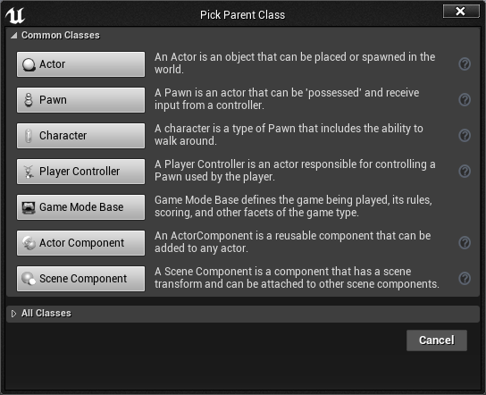

# NTUOSS Unreal Engine 4 Workshop

##### *made with love by [Yong Hao](https://github.com/HORACEYOUNG) for NTU Open Source Society*

*Leave a star if you like this~*

---

### Workshop Details

**When**: Friday, 1 Nov 2019. 6:30 PM - 8:30 PM.
**Where**: LT1, NTU North Spine Plaza
**Who**: NTU Open Source Society

**Questions**: We will be hosting a Pigeon Hole Live for collecting questions regarding the workshop.

Feedback & Error Reports: We will send out the link for collecting feedback as usual.
​	

For further discussion or cooperation please contact YO0001AO@e.ntu.edu.sg.

***Disclaimer: This workshop is for educational purposes only. The artistic resources are retrieved from Nintendo Co., Ltd. and information regarding Unreal concepts are retrieved from [Unreal Document](https://docs.unrealengine.com/en-US/index.html). The idea and content of the workshop is inspired by [Virtus Learning Hub](https://www.virtushub.com/), who is a provider and educator in the field of game-related softwares. For more beneficial information, you can always check out his channel on youtube and other content creators as well***

***No prototype or outcome of any type is intended for commercial use.***

---
### Prerequisites

1. **Unreal Engine 4 Software (as UE4 in upcoming texts)**

   [You can download UE4 by clicking this link.](https://www.unrealengine.com/en-US/download)

   **Warning: We highly recommend you to download UE4 prior to coming to this workshop as it may take 30 - 60 minutes to complete the download. Meanwhile do remember to register an Epic Games account as you may be required to do so.**

2. **Basic Object-Oriented Programming Knowledge (optional)**

   **In this workshop, all the scripts are going to be written in Blueprint. **

   The Blueprints Visual Scripting system in Unreal Engine is a complete gameplay scripting system based on the concept of using a **node-based interface** to create gameplay elements from within Unreal Editor. As with many common scripting languages, it is used to define object-oriented (OO) classes or objects in the engine. As you use UE4, you'll often find that objects defined using Blueprint are colloquially referred to as just "Blueprints."

   This system is extremely flexible and powerful as it provides the ability for designers to use virtually the full range of concepts and tools generally only available to programmers. In addition, Blueprint-specific markup available in Unreal Engine's C++ implementation enables programmers to create baseline systems that can be extended by designers.

---
## Task 0. Introduction

### What is Unreal 4 Engine?

The Unreal Engine is a game engine developed by Epic Games, first showcased in the 1998 first-person shooter game Unreal. Although initially developed for first-person shooters, it has been successfully used in a variety of other genres, including platformers, fighting games, MMORPGs, and other RPGs. With its code written in C++, the Unreal Engine features a high degree of portability and is a tool used by many game developers today, with it being source-available. The most recent version is Unreal Engine 4, which was released in 2014.

In a few words:

- Developed by Epic Games
- High Graphics Quality
- And most importantly: Blueprint, which enables you to write logic without coding.

---
## Task 1. Create your first Project

​	After you’ve finished downloading the UE4 Engine and signed in your Epic Games account, you’ll be directed to the following interface to create your very first project.

​	

First of all, we’re going to introduce the Blueprint Visual Scripting Language in the following sections, so make sure you choose Blueprint instead of C++ and choose “Third Person” under the tag.

Next, we’re building a mobile game today, so choose the platform to be “Mobile/Tablet” and leave the other two options as they were.

Finally, choose a location for your project and give your project a name and click Create Project, you’re now good to go!

## Task 2. UE4 Level Editor UI Overview

The **Level Editor** provides the core level creation functionality for Unreal Editor. This is where levels are created, viewed, and modified mainly by placing, transforming, and editing the properties of [**Actors**](https://docs.unrealengine.com/en-US/Engine/Actors/index.html).

In Unreal Editor, the scenes in which you create your game experience are generally referred to as [Levels](https://docs.unrealengine.com/en-US/Engine/Levels/index.html). You can think of a level as a 3D environment into which you place a series of objects and geometry to define the world your players will experience. Any object that is placed in your world, be it a light, a mesh, or a character, is considered to be an Actor. Technically speaking, *Actor* is a programming class used within the Unreal Engine to define an object that has 3D position, rotation, and scale data. For sake of ease, however, it will be easiest to think of an Actor as *any object that can be placed in your levels*.

After your computer has finished loading your project, your UE4 Editor should look something like this below:

It feels quite messy for the beginners I understand, so here I’ll do a brief introduction on the Editor’s User Interface you you have an idea on what do all these parts do. The details of the following elaboration can be found at [Unreal Documentation: Editor Interface](https://docs.unrealengine.com/en-US/Engine/UI/LevelEditor/index.html)

1. Tab Bar and Menu Bar

   

   The Level Editor has a tab along the top providing the name of the level currently being edited. Tabs from other editor windows may be docked alongside this tab for quick and easy navigation, similar to a web browser.

   To the right of the Tab Bar is the name of the current project.

   

   The **Menu Bar** in editor should be familiar to anyone who has used Windows applications previously. It provides access to general tools and commands that are used when working with levels in the editor.

2. Toolbar

   

   The **Toolbar** panel, like in most applications, is a group of commands providing quick access to commonly used tools and operations.

3. Modes

   

   The **Modes** panel contains a selection of various tool modes for the Editor. These change the primary behaviour of the Level Editor for a specialized task, such as placing new assets into the world, creating geometry brushes and volumes, painting on meshes, generating foliage, and sculpting landscapes.

4. Content Browser

   A file manager section in which you manage all the files and resources within the project.

5. Viewports

   

   The **Viewport** panel is your window into the worlds you create in UnrealEd.

   This panel contains a set of viewports, each of which can be maximized to fill the entire panel and offer the ability to display the world from one of three orthographic views (Top, Side, Front) or a perspective view giving you complete control over what you see as well as how you see it.

6. World Outliner

   

   The **World Outliner** panel displays all of the Actors within the scene in a hierarchical tree view. Actors can be selected and modified directly from the **World Outliner**. You can also use the Info drop down menu to turn on an extra column that shows Levels, Layers, or ID Names.

7. Details

   

   The **Details** panel contains information, utilities, and functions specific to the current selection in the viewport. It contains transform edit boxes for moving, rotating, and scaling Actors, displays all of the editable properties for the selected Actors, and provides quick access to additional editing functionality depending on the type of Actor(s) selected in the viewport. For instance, selected Actors can be exported to FBX and converted to another compatible type. The Selection Details also allows you to view the materials used by the selected Actors, if any, and quickly open them for editing.

   

---

## Task 3. Introduction to Blueprint Visual Scripting

### Task 3.1. Blueprint Overview

The **Blueprints Visual Scripting** system in Unreal Engine is a complete gameplay scripting system based on the concept of using a node-based interface to create gameplay elements from within Unreal Editor. As with many common scripting languages, it is used to define object-oriented (OO) classes or objects in the engine. As you use UE4, you'll often find that objects defined using Blueprint are colloquially referred to as just "Blueprints."

Let us take a look and have a intuitive concept about blueprint, navigating to ThirdPersonBP -> Blueprints -> ThirdPersonCharacter:

This system is extremely flexible and powerful as it provides the ability for designers to use virtually the full range of concepts and tools generally only available to programmers. In addition, Blueprint-specific mark-up available in Unreal Engine's C++ implementation enables programmers to create baseline systems that can be extended by designers.

The workflow of the blueprint scripting language can be visualized as below (adopted from [link](https://www.youtube.com/watch?v=MWepzQqAS60&list=PLL0cLF8gjBpqRUy7r0DtVY3Fcdgq5Wk-h&index=3)):

The blueprint programming language is almost like the real spoken language, where you have a subject,  a verb, and an object, to describe a certain action that the subject has done to the object. While in blueprint, what we have is the structure in the image above, where when certain “events” happen, an action will be applied to an object. The subject here depends on the context to be either the system or the player.

Now let’s look at the different categories of blueprints in the Unreal Engine.

### Task 3.2. Categories of Blueprint

#### 3.2.1. Level Blueprints

The level blueprint contains the blueprint code to control the entire level. It can only reference the objects within the level and the effects of one level blueprint will not be carried along to the next level.

Let us try out the level blueprint with a fairly simple example: we’re going to control a light in the scene, and after a few seconds, make it disappear.

First of all, let us create a point light object by dragging it from the modes panel to the scene:

Now open the level blueprint by navigating to Blueprints -> Open level blueprints:

To add components to the level blueprint, right click and add one “Event Begin Play”, one “Point Light” Reference and one “Toggle Visibility” to the game, and insert one “delay” between “Event Begin Play” and “Toggle Visibility”:

#### 3.2.2. Class Blueprints

Like we’ve mentioned earlier, blueprint is an object-oriented programming language, the class blueprint is designed for individual objects. Objects in game like player, enemies, items, buffs, or even health bars can all be written in the form of class blueprints. Class blueprints can be duplicated, which is extremely useful as you do not have to rewrite your code for objects that perform the same functions.

Let’s try an example by making multiple lights that will be turned off once your character touched them.

Navigate to the folder “ThirdPersonBP”, right click and under blueprint tab select “Blueprint Class”, you’ll be having something as shown below:

Here we select actor as it’s the most common template for blueprint class. We will name it light setup, and you will see something as below:

This is the default template of the blueprint class, the white ball in the centre represents the origin of the object. We now add a point light by click “Add Component” by clicking on the button on the top left side of the screen, then add a static mesh component and select the material called “SM_Lamp_Wall”:

Then add a box collision component to the light, this is to detect if the player has contacted the lamp for actions to happen:

Then navigate to the event graph and write blueprint as below:

This basically means any object that get in touch with the box collision of the point light, it will be first casted to the ThirdPersonCharacter class, and if successful, the designated event will happen, in this case “Toggle Visibility”. Now get back to the game and we will notice the light will be toggled once the player get close to the point light:

#### 3.3.3. Variables and Loops in Blueprint

##### 3.3.3.1. Variables

Like any other programming language, blueprint has several generic variable types to play with, as the list below:

You might has already noticed the types that are familiar to you, like Boolean integer and float. Some other important ones and their descriptions are listed below:

Vector: composed three floating point numbers in the form of (x,y,z)

Rotator: contains the rotation information of the object

Transform: contains the information of position, rotation, and scale.

To view the content of the variables, simply adopt the blueprint below:

##### 3.3.3.2. Branches and Conditions

Branches are very much like the if statements in general programming language, it has different output depending on different input true or false values, like below:

##### 3.3.3.3. Loops

Again Very much like for and while loops in general programming language.

###### 3.3.3.3.1. For Loop

It will execute the loop body for (Last Index - First Index + 1) Times. You can manage the index from the index node like what we did, to print out the index for every loop it takes.

###### 3.3.3.3.2. While Loop

## Task 4. Build the Game (May Involve Multiple Tasks)
## Task N. Export the Game
## Acknowledgements

Many thanks to NTUOSS and its supportive committee~

Greatest love for all of you who come today~

Yours,

YH